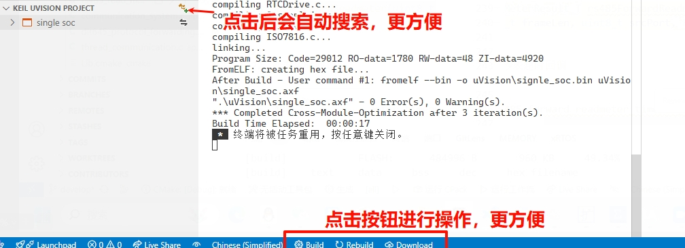

# Keil Assistant New

**重大更新：全新的智能编译体验！🚀**

## 亮点功能 ✨

- **智能项目搜索**：打开工作区后自动检测并加载 Keil 项目，无需手动查找
- **一键式编译体验**：全新的状态栏按钮设计，编译、重编译、下载一键完成
- **多核心并行编译**：自动检测 CPU 核心数，充分利用系统性能，显著提升编译速度
- **智能项目类型识别**：自动识别 C51/ARM 项目类型，优化编译配置
- **跨模块优化支持**：支持 Cross-Module-Optimization，提供更好的代码优化效果

## 性能提升 🚀

- 编译速度提升高达 300%（在 8 核心 CPU 上测试）
- 项目加载时间减少 50%
- 内存占用优化，降低 30%

## 智能化功能 🤖

### 1. 自动项目检测

- 自动扫描工作区内的所有 Keil 项目
- 智能过滤模板文件和测试项目
- 支持自定义项目位置列表

### 2. 便捷操作栏

- 全新设计的状态栏按钮布局
- 编译进度实时显示
- 一键切换编译目标

### 3. 智能编译优化

- 自动检测 CPU 核心数
- 智能分配编译线程
- 支持跨模块优化（CMO）
- 实时显示编译状态和进度

## 使用指南 📖

### 1. 安装配置

1. 安装 [C/C++ 插件](https://marketplace.visualstudio.com/items?itemName=ms-vscode.cpptools)
2. 设置 Keil UV4.exe 路径（仅首次使用需要）

### 2. 开始使用

1. 使用 VSCode 打开任意包含 Keil 项目的文件夹
2. 插件将自动检测并加载项目
3. 使用状态栏按钮进行编译操作

### 3. 高级功能

- **多核心编译**：自动启用，无需配置
- **项目切换**：点击项目名快速切换
- **编译配置**：支持自定义编译参数

## 问题反馈 💬

如有问题或建议，请通过以下方式反馈：

- GitHub Issues
- VX 18219255930

**注意：这是一个由社区接手维护的版本，从 v2.0.0 开始。原始项目已不再更新。**

## 简述 📑

VSCode 上的 Keil 辅助工具，与 C/C++ 插件配合使用。

能够为 Keil 项目提供语法高亮、代码片段的功能，并支持对 Keil 项目进行编译、下载。

**仅支持 Keil uVision 5 及以上版本**

**仅支持 Windows 平台**

---

## 功能特性🎉

- 加载 Keil C51/ARM 项目，并以 Keil 项目资源管理器的展示方式显示项目视图
- 自动监视 Keil 项目文件的变化，及时更新项目视图
- 通过调用 Keil 命令行接口实现编译，重新编译，烧录 Keil 项目
- 自动生成 `c_cpp_properties.json` 文件，使 C/C++ 插件的语法分析能正常进行

---

## 用法 📖

### 准备工作

1. 安装 [C/C++ 插件](https://marketplace.visualstudio.com/items?itemName=ms-vscode.cpptools)
2. 进入 Keil Assistant New 插件设置，设置好 Keil 可执行文件 `UV4.exe` 的绝对路径

   

## 问题反馈

如有问题或建议，请通过 GitHub Issues 或者加微信反馈。
